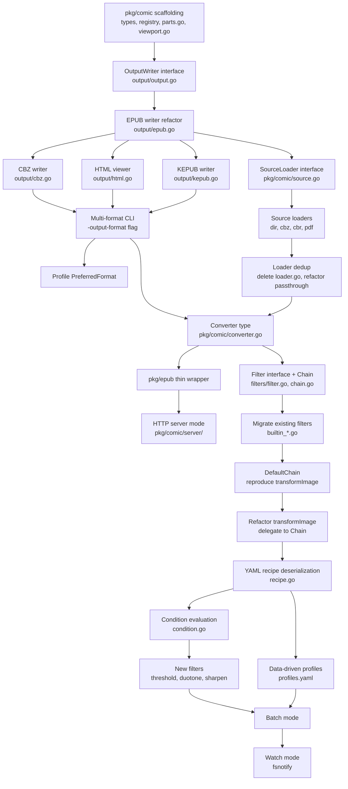

# Implementation Plan: 3 → 1 → 2

> **Module**: `github.com/celogeek/go-comic-converter/v3` (Go 1.23)  
> **Sequence**: Path 3 (Multi-Output Delivery Engine) → Path 1 (Embeddable Go Library + Service Mode) → Path 2 (Extensible Filter Pipeline)  
> **Rationale**: Path 3 is lowest-risk (pipeline already format-agnostic via temp ZIP), highest 2-week value. Path 1's SourceLoader extraction benefits from Path 3's refactor. Path 2's filter chain builds on the stable `pkg/comic` API from Path 1.

---

## Phase 0: Foundation (shared across all paths)

### 0.1 Create `pkg/comic` package scaffolding

**New package**: `pkg/comic/` — the future stable public API root.

```
pkg/comic/
├── doc.go              # package doc with usage example
├── options.go          # re-export from epuboptions (type Options = epuboptions.EPUBOptions)
├── types.go            # shared types: Part, PartMetadata, OutputPart (used by Path 3 output writers)
└── registry.go         # generic registry pattern (RegisterX / LookupX) used by source/output/filter registries
```

**`pkg/comic/options.go`**:
```go
package comic

import "github.com/celogeek/go-comic-converter/v3/pkg/epuboptions"

// Options is the public alias for the options type.
// It re-exports epuboptions.EPUBOptions to provide a stable import path
// independent of the output format.
type Options = epuboptions.EPUBOptions
```

**`pkg/comic/types.go`** — shared output types (used by Path 3, defined here to avoid forward-dependencies):
```go
package comic

import (
    "image"

    "github.com/celogeek/go-comic-converter/v3/internal/pkg/epubimage"
    "github.com/celogeek/go-comic-converter/v3/pkg/epuboptions"
)

// Part is a format-agnostic grouping of processed images.
// It is produced by the part-splitting logic and consumed by output writers.
type Part struct {
    Cover  epubimage.EPUBImage
    Images []epubimage.EPUBImage
}

// PartMetadata holds the metadata for an output part.
type PartMetadata struct {
    Title       string
    Author      string
    Publisher   string
    UID         string
    UpdatedAt   string
    ImageOptions epuboptions.Image
}

// OutputPart is the full data bundle passed to an OutputWriter.
type OutputPart struct {
    PartNumber  int
    TotalParts  int
    Part        Part
    Metadata    PartMetadata
    ImgStorage  epubzip.StorageImageReader  // temp ZIP reader for processed images
}
```

**`pkg/comic/registry.go`** — generic registry:
```go
package comic

import "sync"

// registry is a concurrency-safe generic key-value store for extensibility points.
type registry[V any] struct {
    mu sync.RWMutex
    m  map[string]V
}

func newRegistry[V any]() *registry[V] {
    return &registry[V]{m: make(map[string]V)}
}

func (r *registry[V]) register(name string, v V) {
    r.mu.Lock()
    defer r.mu.Unlock()
    r.m[name] = v
}

func (r *registry[V]) lookup(name string) (V, bool) {
    r.mu.RLock()
    defer r.mu.RUnlock()
    v, ok := r.m[name]
    return v, ok
}

func (r *registry[V]) names() []string {
    r.mu.RLock()
    defer r.mu.RUnlock()
    names := make([]string, 0, len(r.m))
    for k := range r.m {
        names = append(names, k)
    }
    return names
}
```

### 0.2 Extract format-agnostic part-splitting into `pkg/comic/parts.go`

The current `getParts` method in `pkg/epub/epub.go:258-328` does two things:
1. **Format-agnostic**: calls `imageProcessor.Load(ctx)`, sorts images by Id/Part, extracts cover, opens `StorageImageReader`, splits images into size-bounded groups
2. **EPUB-coupled**: only in that it returns `epubPart` (which is just `{Cover, Images}`) and uses `imgStorage.Size(img.EPUBImgPath())`

Extract a shared function:

**`pkg/comic/parts.go`**:
```go
package comic

import (
    "context"
    "fmt"
    "path/filepath"
    "sort"

    "github.com/celogeek/go-comic-converter/v3/internal/pkg/epubimage"
    "github.com/celogeek/go-comic-converter/v3/internal/pkg/epubzip"
)

// GetParts loads images via the processor, sorts them, extracts the cover,
// opens the temp ZIP reader, and splits into size-bounded parts.
// This is format-agnostic — output writers consume the resulting []Part.
func GetParts(ctx context.Context, proc epubimageprocessor.EPUBImageProcessor, opts Options, strict bool) (parts []Part, imgStorage epubzip.StorageImageReader, err error) {
    // ... (moved from epub.go getParts, returning []comic.Part instead of []epubPart)
}
```

**Key change**: `epubPart` (epub.go:40) becomes `comic.Part` (pkg/comic/types.go). The `epub.go getParts` method delegates to `comic.GetParts` and converts `[]comic.Part` → `[]epubPart` (or uses `comic.Part` directly since the struct is identical).

### 0.3 Extract `computeAspectRatio` and `computeViewPort`

**From**: `pkg/epub/epub.go:333-377`  
**To**: `pkg/comic/viewport.go`

```go
package comic

import "math"

// ComputeAspectRatio finds the most common aspect ratio across all parts.
// Format-agnostic: operates only on image dimensions.
func ComputeAspectRatio(parts []Part) float64 { ... }

// ComputeViewPort adjusts the viewport dimensions based on the configured
// aspect ratio mode. Format-agnostic: operates only on View options + image dims.
func ComputeViewPort(parts []Part, view epuboptions.View) (int, int) { ... }
```

`epub.go` delegates: `e.computeAspectRatio(parts)` → `comic.ComputeAspectRatio(parts)`.

### 0.4 Promote `EPUBImageProcessor` interface toward public visibility

Currently at `internal/pkg/epubimageprocessor/processor.go:22-25`:
```go
type EPUBImageProcessor interface {
    Load(ctx context.Context) (images []epubimage.EPUBImage, err error)
    CoverTitleData(o CoverTitleDataOptions) (epubzip.Image, error)
}
```

**Phase 0 does NOT move it yet** (that's Path 1). Phase 0 only ensures `pkg/comic` can reference it via the internal package path. The `pkg/comic` package imports `internal/pkg/epubimageprocessor` — this is valid since `pkg/comic` is part of the same module.

### 0.5 Files touched in Phase 0

| File | Action |
|------|--------|
| `pkg/comic/doc.go` | **Create** — package doc |
| `pkg/comic/options.go` | **Create** — `type Options = epuboptions.EPUBOptions` |
| `pkg/comic/types.go` | **Create** — `Part`, `PartMetadata`, `OutputPart` |
| `pkg/comic/registry.go` | **Create** — generic registry |
| `pkg/comic/parts.go` | **Create** — `GetParts()` extracted from epub.go:258-328 |
| `pkg/comic/viewport.go` | **Create** — `ComputeAspectRatio()` + `ComputeViewPort()` from epub.go:333-377 |
| `pkg/epub/epub.go` | **Modify** — `getParts` delegates to `comic.GetParts`; `computeAspectRatio`/`computeViewPort` delegate to `comic.*`; `epubPart` becomes alias for `comic.Part` |
| `pkg/epub/epub_test.go` | **Modify** — ensure existing tests still pass (no behavioral change) |

### 0.6 Verification (Phase 0)

```bash
go build ./...
go test -timeout 120s -count=1 -race ./pkg/epub/... ./pkg/comic/...
go vet ./...
```
Existing `pkg/epub/epub_test.go` tests (template escaping, content XML, ErrImageCorrupted, Write behavior) must pass unchanged — this is a pure refactor.

---

## Phase 1: Multi-Output Delivery Engine (Path 3)

### Week 1: OutputWriter interface + refactor epub.go → output/epub.go

#### 1.1 Create `pkg/comic/output/` package with OutputWriter interface

**New package**: `pkg/comic/output/`

**`pkg/comic/output/output.go`**:
```go
package output

import (
    "context"

    "github.com/celogeek/go-comic-converter/v3/pkg/comic"
    "github.com/celogeek/go-comic-converter/v3/internal/pkg/epubzip"
)

// OutputWriter produces one or more output files from processed image parts.
type OutputWriter interface {
    // Write produces output file(s) from the given parts.
    // parts contains the format-agnostic grouped images.
    // imgStorage provides access to the temp ZIP of processed images.
    // opts contains all conversion options.
    // Returns the list of output file paths created.
    Write(ctx context.Context, parts []comic.Part, imgStorage epubzip.StorageImageReader, opts comic.Options, metadata comic.PartMetadata) ([]string, error)

    // Format returns the output format identifier (e.g., "epub", "kepub", "cbz", "html").
    Format() string

    // SupportsPartSplit indicates if the format benefits from size-based splitting.
    // EPUB/KEPUB: true (size limits for email/SendToKindle). CBZ/HTML: false.
    SupportsPartSplit() bool

    // Extension returns the file extension for this format (e.g., ".epub", ".cbz", ".html").
    Extension() string
}

// Registry for output writers.
var outputRegistry = newOutputRegistry()

func Register(format string, w OutputWriter) { outputRegistry.register(format, w) }
func Lookup(format string) (OutputWriter, bool) { return outputRegistry.lookup(format) }
func Formats() []string { return outputRegistry.names() }
```

#### 1.2 Refactor EPUB writer to implement OutputWriter

**Move**: EPUB-specific write logic from `pkg/epub/epub.go` into `pkg/comic/output/epub.go`.

**`pkg/comic/output/epub.go`**:
```go
package output

import (
    "context"
    "fmt"
    "path/filepath"

    "github.com/celogeek/go-comic-converter/v3/internal/pkg/epubimage"
    "github.com/celogeek/go-comic-converter/v3/internal/pkg/epubprogress"
    "github.com/celogeek/go-comic-converter/v3/internal/pkg/epubtemplates"
    "github.com/celogeek/go-comic-converter/v3/internal/pkg/epubzip"
    "github.com/celogeek/go-comic-converter/v3/internal/pkg/utils"
    "github.com/celogeek/go-comic-converter/v3/pkg/comic"
)

type EPUBWriter struct{}

func init() {
    Register("epub", &EPUBWriter{})
}

func (w *EPUBWriter) Format() string         { return "epub" }
func (w *EPUBWriter) Extension() string       { return ".epub" }
func (w *EPUBWriter) SupportsPartSplit() bool { return true }

func (w *EPUBWriter) Write(ctx context.Context, parts []comic.Part, imgStorage epubzip.StorageImageReader, opts comic.Options, metadata comic.PartMetadata) ([]string, error) {
    // Moved from epub.go writePart (line 384-460) + Write (line 483-567)
    // Iterates parts, computes output path with part suffix, calls writePart
    // Returns list of created .epub file paths
}
```

**Methods moved from `pkg/epub/epub.go` into `pkg/comic/output/epub.go`**:
- `writeImage` (epub.go:113-130) → `epubWriter.writeImage`
- `writeBlank` (epub.go:133-150) → `epubWriter.writeBlank`
- `writeCoverImage` (epub.go:153-180) → `epubWriter.writeCoverImage`
- `writeTitleImage` (epub.go:183-210) → `epubWriter.writeTitleImage`
- `writePart` (epub.go:384-460) → `epubWriter.writePart`
- Template rendering (`render`, `xmlEscape`, funcMap setup from `New` epub.go:57-108) → `epubWriter` struct with template cache

**`pkg/epub/epub.go` becomes a thin compatibility wrapper**:
```go
package epub

import (
    "context"

    "github.com/celogeek/go-comic-converter/v3/internal/pkg/epubimageprocessor"
    "github.com/celogeek/go-comic-converter/v3/internal/pkg/epubimagepassthrough"
    "github.com/celogeek/go-comic-converter/v3/pkg/comic"
    "github.com/celogeek/go-comic-converter/v3/pkg/comic/output"
    "github.com/celogeek/go-comic-converter/v3/pkg/epuboptions"
)

var ErrImageCorrupted = errors.New("one or more images are corrupted")

type EPUB interface {
    Write(ctx context.Context) error
}

type epub struct {
    opts  comic.Options
    proc  epubimageprocessor.EPUBImageProcessor
}

func New(options epuboptions.EPUBOptions) EPUB {
    var proc epubimageprocessor.EPUBImageProcessor
    if options.Image.Format == "copy" {
        proc = epubimagepassthrough.New(options)
    } else {
        proc = epubimageprocessor.New(options)
    }
    return &epub{opts: comic.Options(options), proc: proc}
}

func (e *epub) Write(ctx context.Context) error {
    parts, imgStorage, err := comic.GetParts(ctx, e.proc, e.opts, e.opts.Strict)
    if err != nil {
        return err
    }
    defer func() {
        _ = imgStorage.Close()
        _ = imgStorage.Remove()
    }()

    // Dry mode handling (moved from old Write)
    if e.opts.Dry { ... }

    writer, _ := output.Lookup("epub")
    _, err = writer.Write(ctx, parts, imgStorage, e.opts, comic.PartMetadata{...})
    return err
}
```

#### 1.3 Update temp ZIP lifecycle ownership

Currently the temp ZIP is created in `processor.Load()` (processor.go:78) and cleaned up in `epub.Write()` (epub.go:493). After refactor:
- **Creation** stays in `processor.Load()` — the processor writes processed images to the temp ZIP during the image pipeline
- **Reader + cleanup** moves to the caller (either `pkg/epub/epub.go` wrapper or `pkg/comic.Converter` in Path 1)
- The `OutputWriter.Write` method receives the `StorageImageReader` as a parameter — it does NOT own the lifecycle

#### 1.4 Update `internal/pkg/converter/converter.go` Validate for multi-format output paths

**File**: `internal/pkg/converter/converter.go:265-310` (Validate method, output path computation)

Add `OutputFormat` field to `Options` (options.go) and validate:
```go
// In Options struct (options.go)
OutputFormat string `yaml:"output_format" json:"output_format"`

// In Validate() (converter.go)
if !slices.Contains([]string{"epub", "kepub", "cbz", "html", "all"}, c.Options.OutputFormat) {
    return errors.New("output-format should be epub, kepub, cbz, html, or all")
}
```

Output path default changes: if format is `kepub`, default extension is `.kepub.epub`; if `cbz`, `.cbz`; if `html`, `.html`; if `all`, base name with format-specific extensions.

#### 1.5 Files touched in Week 1

| File | Action |
|------|--------|
| `pkg/comic/output/output.go` | **Create** — `OutputWriter` interface + registry |
| `pkg/comic/output/epub.go` | **Create** — EPUB writer (moved from epub.go write methods) |
| `pkg/epub/epub.go` | **Modify** — thin wrapper delegating to `output.EPUBWriter` |
| `pkg/epub/epub_test.go` | **Modify** — update tests for new delegation; ensure all pass |
| `internal/pkg/converter/options.go` | **Modify** — add `OutputFormat` field |
| `internal/pkg/converter/converter.go` | **Modify** — add `-output-format` flag (InitParse:95), validate in Validate:265, default output path logic |
| `internal/pkg/converter/validate_test.go` | **Modify** — add tests for output-format validation |

#### 1.6 Verification (Week 1)

```bash
go build ./...
go test -timeout 120s -count=1 -race ./pkg/epub/... ./pkg/comic/... ./internal/pkg/converter/...
```
**Smoke test**: `go run . -input testdata/sample.cbz -profile SR -output-format epub -dry` produces identical output to pre-refactor.

---

### Week 2: CBZ writer + HTML viewer

#### 2.1 CBZ writer (`pkg/comic/output/cbz.go`)

The temp ZIP (`StorageImageWriter`) already contains sorted, processed, compressed images. The CBZ writer reads from `StorageImageReader` and writes a clean CBZ.

**`pkg/comic/output/cbz.go`**:
```go
package output

import (
    "archive/zip"
    "context"
    "fmt"
    "os"
    "path/filepath"

    "github.com/celogeek/go-comic-converter/v3/internal/pkg/epubzip"
    "github.com/celogeek/go-comic-converter/v3/pkg/comic"
)

type CBZWriter struct{}

func init() {
    Register("cbz", &CBZWriter{})
}

func (w *CBZWriter) Format() string         { return "cbz" }
func (w *CBZWriter) Extension() string       { return ".cbz" }
func (w *CBZWriter) SupportsPartSplit() bool { return false }

func (w *CBZWriter) Write(ctx context.Context, parts []comic.Part, imgStorage epubzip.StorageImageReader, opts comic.Options, metadata comic.PartMetadata) ([]string, error) {
    // Single output file (no part splitting for CBZ)
    // Iterate all images across all parts in order
    // For each image: read from imgStorage.Get(img.EPUBImgPath())
    // Write to new zip with sequential naming (0001.jpg, 0002.jpg, ...)
    // ~50 lines of new code
}
```

**Key detail**: The `EPUBImgPath()` method on `EPUBImage` (epub_image.go) returns the path within the temp ZIP. The CBZ writer reads these entries and rewrites them with clean sequential names.

#### 2.2 HTML viewer writer (`pkg/comic/output/html.go`)

**`pkg/comic/output/html.go`**:
```go
package output

type HTMLWriter struct{}

func init() {
    Register("html", &HTMLWriter{})
}

func (w *HTMLWriter) Format() string         { return "html" }
func (w *HTMLWriter) Extension() string       { return ".html" }
func (w *HTMLWriter) SupportsPartSplit() bool { return true } // each part → separate HTML file
```

**Embedded resources** via `go:embed`:
```
pkg/comic/output/
├── html.go                    # writer logic
├── html_viewer.tmpl           # HTML template with {{.Images}} base64 images
├── html_viewer.js             # vanilla JS: keyboard nav, touch swipe, double-page
└── html_viewer.css            # responsive CSS
```

```go
//go:embed html_viewer.tmpl html_viewer.js html_viewer.css
var htmlFS embed.FS
```

The writer:
1. Iterates parts (each part → one HTML file)
2. For each image: reads from `imgStorage`, base64-encodes, embeds in ``
3. Injects the embedded JS/CSS inline (self-contained single file)
4. ~200 lines of writer logic + ~200 lines embedded JS/CSS/HTML

**Scope discipline**: vanilla JS only, no dependencies. Features: arrow-key navigation, touch swipe, double-page spread toggle, progress indicator. No settings panel, no themes, no lazy loading.

#### 2.3 Multi-output orchestration

When `-output-format all` is specified, the orchestrator runs the image pipeline **once** (via `comic.GetParts`), then iterates the registered output writers.

**In `pkg/epub/epub.go` wrapper (or `pkg/comic/converter.go` in Path 1)**:
```go
func writeAll(ctx context.Context, parts []comic.Part, imgStorage epubzip.StorageImageReader, opts comic.Options, metadata comic.PartMetadata) ([]string, error) {
    var allPaths []string
    for _, format := range []string{"epub", "kepub", "cbz", "html"} {
        w, ok := output.Lookup(format)
        if !ok {
            continue
        }
        paths, err := w.Write(ctx, parts, imgStorage, opts, metadata)
        if err != nil {
            return allPaths, fmt.Errorf("output %s: %w", format, err)
        }
        allPaths = append(allPaths, paths...)
    }
    return allPaths, nil
}
```

#### 2.4 Output path computation for multi-format

In `converter.go Validate()` (line 265-310), when `-output-format all`:
- The `-output` flag specifies the **base name** (without extension)
- Each writer appends its extension: `.epub`, `.kepub.epub`, `.cbz`, `.html`
- Part suffixes (`Part 01 of 03`) are added per-writer based on `SupportsPartSplit()`

#### 2.5 Files touched in Week 2

| File | Action |
|------|--------|
| `pkg/comic/output/cbz.go` | **Create** — CBZ writer (~50 lines) |
| `pkg/comic/output/html.go` | **Create** — HTML writer (~200 lines) |
| `pkg/comic/output/html_viewer.tmpl` | **Create** — HTML template |
| `pkg/comic/output/html_viewer.js` | **Create** — vanilla JS viewer |
| `pkg/comic/output/html_viewer.css` | **Create** — CSS |
| `pkg/comic/output/epub.go` | **Modify** — add multi-output orchestration helper |
| `pkg/epub/epub.go` | **Modify** — call multi-output when format is "all" |
| `internal/pkg/converter/converter.go` | **Modify** — output path logic for multi-format |
| `pkg/comic/output/cbz_test.go` | **Create** — CBZ writer tests |
| `pkg/comic/output/html_test.go` | **Create** — HTML writer tests |

#### 2.6 Verification (Week 2)

```bash
go build ./...
go test -timeout 120s -count=1 -race ./pkg/comic/output/...
```
**Smoke test**: 
- `go run . -input testdata/sample.cbz -profile SR -output-format cbz` → produces `.cbz` file, valid ZIP of images
- `go run . -input testdata/sample.cbz -profile SR -output-format html` → produces `.html` file, opens in browser, keyboard nav works
- `go run . -input testdata/sample.cbz -profile SR -output-format all` → produces 3 files (epub + cbz + html), image pipeline runs once (verify via single progress bar)

---

### Week 3: KEPUB writer + multi-format CLI flags + `-output-format all`

#### 3.1 KEPUB writer (`pkg/comic/output/kepub.go`)

KEPUB is EPUB with Kobo-specific enhancements. ~80% shared with EPUB writer.

**`pkg/comic/output/kepub.go`**:
```go
package output

type KEPUBWriter struct {
    *EPUBWriter  // embed EPUB writer for shared logic
}

func init() {
    Register("kepub", &KEPUBWriter{&EPUBWriter{}})
}

func (w *KEPUBWriter) Format() string         { return "kepub" }
func (w *KEPUBWriter) Extension() string       { return ".kepub.epub" }
func (w *KEPUBWriter) SupportsPartSplit() bool { return true }
```

**Differences from EPUB** (override methods):
1. **Page XHTML**: wrap each `` in `<div class="kobolink"></div>` for panel-zoom
   - Override `writePart` to use KEPUB-specific text template
2. **content.opf**: add `<meta name="kobo-style" content="..."/>` metadata
   - Override template rendering with KEPUB content template
3. **style.css**: include kobo-specific span styling
4. **Extension**: `.kepub.epub` (double extension)

**New templates**:
```
internal/pkg/epubtemplates/
├── kepub_text.xhtml.tmpl    # KEPUB page template with kobolink divs
└── kepub_content.go         # KEPUB content.opf generator (extends Content struct)
```

**Implementation approach**: 
- The `EPUBWriter` should be refactored to have overridable hooks: `pageTemplate()`, `contentOpf()`, `styleCSS()`, `imageWrapper()`
- `KEPUBWriter` overrides these hooks; everything else (zip creation, image writing, part iteration) is inherited
- This avoids duplicating the ~60-line `writePart` method

#### 3.2 Profile `PreferredFormat` field

**File**: `internal/pkg/converter/profiles.go:12-16`

```go
type Profile struct {
    Code            string `json:"code" yaml:"code"`
    Description     string `json:"description" yaml:"description"`
    Width           int    `json:"width" yaml:"width"`
    Height          int    `json:"height" yaml:"height"`
    PreferredFormat string `json:"preferred_format,omitempty" yaml:"preferred_format,omitempty"` // NEW
}
```

Add `PreferredFormat` to Kobo profiles:
```go
{"KoC", "Kobo Clara HD/Kobo Clara 2E", 1072, 1448, "kepub"},
{"KoL", "Kobo Libra H2O/Kobo Libra 2", 1264, 1680, "kepub"},
// ... all Kobo profiles get "kepub"
```

In `main.go generate()` (line 106-109), after setting profile dimensions:
```go
if profile.PreferredFormat != "" && cmd.Options.OutputFormat == "" {
    cmd.Options.OutputFormat = profile.PreferredFormat
}
```

#### 3.3 CLI flag registration

**File**: `internal/pkg/converter/converter.go` InitParse (line 95):

Add to the "Output" section:
```go
c.AddStringParam(&c.Options.OutputFormat, "output-format", "epub", "Output format: epub, kepub, cbz, html, or all")
```

#### 3.4 README update

**File**: `README.md` — add "Output Format" section after the existing `-help` block (around line 400+), documenting:
- `-output-format epub|kepub|cbz|html|all`
- Per-format feature matrix (TOC, metadata, part-split, title page)
- Kobo KEPUB panel-zoom explanation
- CBZ for Komga/Kavita
- HTML for browser preview

#### 3.5 Files touched in Week 3

| File | Action |
|------|--------|
| `pkg/comic/output/kepub.go` | **Create** — KEPUB writer (~150 lines) |
| `pkg/comic/output/epub.go` | **Modify** — extract overridable hooks for KEPUB reuse |
| `internal/pkg/epubtemplates/kepub_text.xhtml.tmpl` | **Create** — KEPUB page template |
| `internal/pkg/epubtemplates/kepub_content.go` | **Create** — KEPUB content.opf generator |
| `internal/pkg/converter/profiles.go` | **Modify** — add `PreferredFormat` field + set on Kobo profiles |
| `internal/pkg/converter/converter.go` | **Modify** — register `-output-format` flag, default from profile |
| `internal/pkg/converter/options.go` | **Modify** — `OutputFormat` field with yaml/json tags |
| `main.go` | **Modify** — use `OutputFormat` to select writer |
| `README.md` | **Modify** — output format documentation |
| `pkg/comic/output/kepub_test.go` | **Create** — KEPUB writer tests |

#### 3.6 Verification (Week 3)

```bash
go build ./...
go test -timeout 120s -count=1 -race ./...
```
**Smoke tests**:
- `go run . -input testdata/sample.cbz -profile KoC` → defaults to `.kepub.epub` (PreferredFormat)
- `go run . -input testdata/sample.cbz -profile KoC -output-format all` → produces 4 files (epub, kepub.epub, cbz, html)
- KEPUB file contains `kobolink` divs in XHTML pages
- `go run . -input testdata/sample.cbz -profile SR -output-format epub` → unchanged EPUB output (backward compat)

---

## Phase 2: Embeddable Go Library + Service Mode (Path 1)

### Week 4: SourceLoader interface + deduplicate loader code

#### 4.1 Define SourceLoader interface

**`pkg/comic/source.go`**:
```go
package comic

import (
    "context"

    "github.com/celogeek/go-comic-converter/v3/internal/pkg/epubimageloader"
)

// SourceLoader reads images from a source (directory, CBZ, CBR, PDF).
// Load returns a channel of Tasks for parallel processing and the total image count.
type SourceLoader interface {
    // Load discovers and decodes images from the input source.
    // Returns totalImages and a channel of Tasks.
    // The channel is closed when all images have been sent or on error.
    Load(ctx context.Context, input string, sortMode int) (totalImages int, output <-chan epubimageloader.Task, err error)
}

// Source registry
var sourceRegistry = newRegistry[SourceLoader]()

func RegisterSource(scheme string, loader SourceLoader) {
    sourceRegistry.register(scheme, loader)
}

func LookupSource(scheme string) (SourceLoader, bool) {
    return sourceRegistry.lookup(scheme)
}
```

#### 4.2 Extract shared source dispatch

The dispatch logic is duplicated in two places:
- `internal/pkg/epubimageprocessor/loader.go:54-76` — `load()` method: stat → IsDir → switch on extension
- `internal/pkg/epubimagepassthrough/passthrough.go:28-44` — `Load()` method: same dispatch (minus PDF)

**Create `pkg/comic/source/dispatch.go`**:
```go
package source

// Dispatch determines the source scheme from the input path.
// Returns "dir", "cbz", "cbr", "pdf", or error.
func Dispatch(input string) (scheme string, err error) {
    fi, err := os.Stat(input)
    if err != nil {
        return "", err
    }
    if fi.IsDir() {
        return "dir", nil
    }
    switch ext := strings.ToLower(filepath.Ext(input)); ext {
    case ".cbz", ".zip":
        return "cbz", nil
    case ".cbr", ".rar":
        return "cbr", nil
    case ".pdf":
        return "pdf", nil
    default:
        return "", fmt.Errorf("unknown file format (%s): support .cbz, .zip, .cbr, .rar, .pdf", ext)
    }
}
```

#### 4.3 Create SourceLoader implementations

**`pkg/comic/source/dir.go`** — directory loader:
```go
package source

type DirLoader struct{}

func init() {
    comic.RegisterSource("dir", &DirLoader{})
}

func (l *DirLoader) Load(ctx context.Context, input string, sortMode int) (int, <-chan epubimageloader.Task, error) {
    // Extracted from epubimageprocessor/loader.go loadDir (lines 84-180)
    // Uses epubimageloader.IsSupportedImage, sortpath.By
    // Returns channel of decoded Tasks
}
```

**`pkg/comic/source/cbz.go`** — CBZ/ZIP loader:
```go
// Extracted from epubimageprocessor/loader.go loadCbz (lines 182-260)
// Uses archive/zip, epubimageloader.DecodeBounded
```

**`pkg/comic/source/cbr.go`** — CBR/RAR loader:
```go
// Extracted from epubimageprocessor/loader.go loadCbr (lines 262-380)
// Uses rardecode, handles solid archives with feeder goroutine
```

**`pkg/comic/source/pdf.go`** — PDF loader:
```go
// Extracted from epubimageprocessor/loader.go loadPdf (lines 382-495)
// Uses pdfread/pdfimage
```

#### 4.4 Eliminate duplication between processor and passthrough

**`internal/pkg/epubimageprocessor/processor.go`** — `Load()` (line 36):
- Replace `e.load(ctx)` call with `source.Dispatch(e.Input)` + `loader.Load(ctx, e.Input, e.SortPathMode)`
- Remove `load()`, `loadDir()`, `loadCbz()`, `loadCbr()`, `loadPdf()` from `loader.go` (495 lines → 0, file deleted)
- Remove local `isSupportedImage()` (loader.go:30-38) — use `epubimageloader.IsSupportedImage(path, true)` instead
- Remove local `corruptedImage()` (loader.go:42-76) — use `epubimageloader.CorruptedImage()` instead

**`internal/pkg/epubimagepassthrough/passthrough.go`** — `Load()` (line 28):
- Replace entire dispatch + loadDir/loadCbz/loadCbr with: `source.Dispatch` + custom passthrough loading (reads raw compressed data without re-encoding)
- The passthrough loader is different: it copies raw data via `copyRawDataToStorage` rather than decoding+transforming. Create `pkg/comic/source/passthrough/` subpackage with raw-copy loaders, OR add a `PassthroughMode bool` to each loader.
- **Decision**: Add passthrough as a separate set of source loaders in `pkg/comic/source/` with a `raw` variant. The `source.DirLoader`, `source.CBZLoader`, `source.CBRLoader` each get a `Raw bool` field. When `Raw=true`, they copy compressed bytes directly instead of decoding to `image.Image`.

**Net effect**: ~930 lines of duplicated dispatch + loader code (loader.go 495ln + passthrough.go 435ln) reduced to ~500 lines of shared source loaders + ~100 lines of passthrough-specific raw-copy logic.

#### 4.5 Files touched in Week 4

| File | Action |
|------|--------|
| `pkg/comic/source.go` | **Create** — `SourceLoader` interface + registry |
| `pkg/comic/source/dispatch.go` | **Create** — `Dispatch()` function |
| `pkg/comic/source/dir.go` | **Create** — directory loader (from loader.go:84-180) |
| `pkg/comic/source/cbz.go` | **Create** — CBZ/ZIP loader (from loader.go:182-260) |
| `pkg/comic/source/cbr.go` | **Create** — CBR/RAR loader (from loader.go:262-380) |
| `pkg/comic/source/pdf.go` | **Create** — PDF loader (from loader.go:382-495) |
| `internal/pkg/epubimageprocessor/loader.go` | **Delete** — all logic moved to `pkg/comic/source/` |
| `internal/pkg/epubimageprocessor/processor.go` | **Modify** — `Load()` calls source loaders; remove `load()` call |
| `internal/pkg/epubimagepassthrough/passthrough.go` | **Modify** — `Load()` calls source loaders with raw mode; delete loadDir/loadCbz/loadCbr |
| `internal/pkg/epubimageloader/loader.go` | **Modify** — ensure all shared helpers are used (remove local duplicates in processor/passthrough) |

#### 4.6 Verification (Week 4)

```bash
go build ./...
go test -timeout 120s -count=1 -race ./...
```
**Critical**: All existing tests must pass, especially:
- `internal/pkg/epubimageprocessor/processor_test.go` — Load dry mode, symlink skipping
- `internal/pkg/epubimagepassthrough/passthrough_test.go` — symlink skipping
- `internal/pkg/epubimageloader/loader_fuzz_test.go` — DecodeBounded, IsSupportedImage, CorruptedImage
- `internal/pkg/converter/validate_test.go` — PDF + copy format validation

**Smoke test**: `go run . -input testdata/sample.cbz -profile SR -output-format epub` produces identical EPUB to pre-refactor (byte comparison if possible).

---

### Week 5: `pkg/comic` public API finalization, documentation

#### 5.1 Create `pkg/comic/converter.go` — the primary public entry point

**`pkg/comic/converter.go`**:
```go
package comic

import (
    "context"

    "github.com/celogeek/go-comic-converter/v3/internal/pkg/epubimageprocessor"
    "github.com/celogeek/go-comic-converter/v3/internal/pkg/epubimagepassthrough"
    "github.com/celogeek/go-comic-converter/v3/internal/pkg/epubprogress"
    "github.com/celogeek/go-comic-converter/v3/internal/pkg/epubzip"
    "github.com/celogeek/go-comic-converter/v3/pkg/comic/output"
)

// Converter is the primary conversion engine.
// It orchestrates source loading, image processing, and output writing.
type Converter struct {
    opts Options
    proc epubimageprocessor.EPUBImageProcessor
}

// New creates a Converter with the given options.
func New(opts Options) *Converter {
    var proc epubimageprocessor.EPUBImageProcessor
    if opts.Image.Format == "copy" {
        proc = epubimagepassthrough.New(opts)
    } else {
        proc = epubimageprocessor.New(opts)
    }
    return &Converter{opts: opts, proc: proc}
}

// Convert runs the full pipeline: load → process → output.
// It selects the output writer based on opts.OutputFormat (or "epub" if empty).
// If format is "all", it runs the pipeline once and writes all formats.
func (c *Converter) Convert(ctx context.Context) error {
    parts, imgStorage, err := GetParts(ctx, c.proc, c.opts, c.opts.Strict)
    if err != nil {
        return err
    }
    defer func() {
        _ = imgStorage.Close()
        _ = imgStorage.Remove()
    }()

    // Dry mode
    if c.opts.Dry { ... }

    // Compute viewport
    c.opts.Image.View.Width, c.opts.Image.View.Height = ComputeViewPort(parts, c.opts.Image.View)

    metadata := PartMetadata{
        Title:        c.opts.Title,
        Author:       c.opts.Author,
        ImageOptions: c.opts.Image,
        // UID, Publisher, UpdatedAt set with defaults
    }

    format := c.opts.OutputFormat
    if format == "" {
        format = "epub"
    }

    if format == "all" {
        return writeAll(ctx, parts, imgStorage, c.opts, metadata)
    }

    w, ok := output.Lookup(format)
    if !ok {
        return fmt.Errorf("unknown output format: %s", format)
    }
    _, err = w.Write(ctx, parts, imgStorage, c.opts, metadata)
    return err
}

// ErrImageCorrupted is re-exported for library users.
var ErrImageCorrupted = epub.ErrImageCorrupted
```

#### 5.2 Add `OutputFormat` to `EPUBOptions`

**File**: `pkg/epuboptions/epub_options.go:4-22`

```go
type EPUBOptions struct {
    // ... existing fields ...
    OutputFormat string `yaml:"output_format" json:"output_format"` // NEW
}
```

#### 5.3 Make `pkg/epub` delegate to `pkg/comic`

**File**: `pkg/epub/epub.go` — becomes a true thin wrapper:

```go
func New(options epuboptions.EPUBOptions) EPUB {
    return &epubAdapter{converter: comic.New(comic.Options(options))}
}

func (e *epubAdapter) Write(ctx context.Context) error {
    return e.converter.Convert(ctx)
}
```

#### 5.4 Update `main.go` to use `pkg/comic`

**File**: `main.go:113` (generate function):

```go
// Before:
if err := epub.New(cmd.Options.EPUBOptions).Write(ctx); err != nil { ... }

// After:
if err := comic.New(comic.Options(cmd.Options.EPUBOptions)).Convert(ctx); err != nil { ... }
```

#### 5.5 Documentation

**`pkg/comic/doc.go`**:
```go
// Package comic provides a library-first API for converting comic archives
// (CBZ, CBR, directories, PDF) to e-reader formats (EPUB, KEPUB, CBZ, HTML).
//
// Usage:
//
//     opts := comic.Options{
//         Input:  "manga.cbz",
//         Output: "manga.epub",
//         Image: epuboptions.Image{
//             Quality:  85,
//             GrayScale: true,
//             Crop:    epuboptions.Crop{Enabled: true, Left: 1, Up: 1, Right: 1, Bottom: 3},
//             View:    epuboptions.View{Width: 1072, Height: 1448},
//             Resize:  true,
//             Format:  "jpeg",
//         },
//         SortPathMode: 1,
//     }
//     if err := comic.New(opts).Convert(context.Background()); err != nil {
//         log.Fatal(err)
//     }
//
// Custom output writers can be registered via output.Register.
// Custom source loaders can be registered via RegisterSource.
package comic
```

**`README.md`** — add "Library Usage" section with Go import example.

#### 5.6 Files touched in Week 5

| File | Action |
|------|--------|
| `pkg/comic/converter.go` | **Create** — `Converter` type, `New()`, `Convert()` |
| `pkg/comic/doc.go` | **Modify** — full package doc with example |
| `pkg/epuboptions/epub_options.go` | **Modify** — add `OutputFormat` field |
| `pkg/epub/epub.go` | **Modify** — delegate to `comic.New().Convert()` |
| `main.go` | **Modify** — use `comic.New()` instead of `epub.New()` |
| `README.md` | **Modify** — library usage section |
| `pkg/comic/converter_test.go` | **Create** — test `New().Convert()` with real input |

#### 5.7 Verification (Week 5)

```bash
go build ./...
go test -timeout 120s -count=1 -race ./...
```
**Library smoke test** — create a minimal Go program that imports `pkg/comic`:
```go
package main
import (
    "context"
    "github.com/celogeek/go-comic-converter/v3/pkg/comic"
    "github.com/celogeek/go-comic-converter/v3/pkg/epuboptions"
)
func main() {
    opts := comic.Options{Input: "sample.cbz", Output: "out.epub", /* ... */}
    comic.New(opts).Convert(context.Background())
}
```

---

### Week 6: HTTP server mode (`-serve` flag)

#### 6.1 Server package

**New package**: `pkg/comic/server/`

```
pkg/comic/server/
├── server.go       # HTTP server, route registration, graceful shutdown
├── handlers.go     # POST /api/convert, GET /api/profiles, GET /api/progress/:jobid, GET /api/health
├── jobs.go         # Job queue with configurable max concurrency
└── sse.go          # SSE event stream using existing JSON progress encoder
```

**`pkg/comic/server/server.go`**:
```go
package server

import (
    "context"
    "net/http"
    "time"
)

type Config struct {
    Addr            string        // ":8080"
    MaxConcurrent   int           // max simultaneous conversions
    AllowLocalPaths bool          // allow local file paths as input (trusted envs)
    UploadDir       string        // temp dir for uploaded files
    ShutdownTimeout time.Duration
}

type Server struct {
    cfg    Config
    jobs   *JobQueue
    server *http.Server
}

func New(cfg Config) *Server { ... }
func (s *Server) Start(ctx context.Context) error { ... }
func (s *Server) Shutdown(ctx context.Context) error { ... }
```

#### 6.2 API endpoints

| Method | Path | Description |
|--------|------|-------------|
| `POST` | `/api/convert` | Multipart upload (file + JSON options) or JSON body with local path. Returns `{"job_id": "..."}` |
| `GET` | `/api/profiles` | Returns list of available device profiles as JSON |
| `GET` | `/api/progress/:jobid` | SSE stream of progress events (reuses `epubprogress.jsonprogress` encoder format) |
| `GET` | `/api/health` | Returns `{"status": "ok"}` |

#### 6.3 Job queue

**`pkg/comic/server/jobs.go`**:
```go
type Job struct {
    ID       string
    Opts     comic.Options
    Status   string // "queued", "processing", "completed", "failed"
    Progress chan ProgressEvent
    Result   error
    CreatedAt time.Time
}

type JobQueue struct {
    maxConcurrent int
    sem           chan struct{}
    jobs          sync.Map // map[string]*Job
}

func (q *JobQueue) Submit(opts comic.Options) (*Job, error) { ... }
func (q *JobQueue) Get(jobID string) (*Job, bool) { ... }
```

#### 6.4 SSE progress stream

The existing `epubprogress/jsonprogress` (epubprogress/json.go:8-37) encodes JSON progress events to stdout. For SSE, wrap this:
- Create a `pipeProgressWriter` that implements `EPUBProgress` and writes events to a channel
- The SSE handler reads from the channel and writes `data: {...}\n\n` frames
- Reuses the existing JSON event format (`{"type":"progress","data":{...}}`)

#### 6.5 Security

- **Path traversal**: if `AllowLocalPaths` is false, reject any input path containing `..` or starting with `/`
- **Upload limits**: max upload size configurable (default 500MB), reject oversized uploads
- **Decompression bomb**: existing `MaxImageDim = 20000` guard in `epubimageloader` (loader.go:20) applies
- **Resource limits**: `MaxConcurrent` semaphore prevents DoS via concurrent conversions
- **Timeout**: per-job context with configurable timeout

#### 6.6 CLI integration

**File**: `internal/pkg/converter/converter.go` InitParse:
```go
c.AddSection("Server")
c.AddStringParam(&c.Options.Serve, "serve", "", "Start HTTP server mode (e.g., :8080)")
c.AddIntParam(&c.Options.MaxConcurrent, "max-concurrent", 2, "Max concurrent conversions in server mode")
c.AddBoolParam(&c.Options.AllowLocalPaths, "allow-local-paths", false, "Allow local file paths as input in server mode")
```

**File**: `main.go` — add serve case:
```go
switch {
case cmd.Options.Version:
    version()
case cmd.Options.Serve != "":
    serve(ctx, cmd)
case cmd.Options.Save:
    save(cmd)
// ... existing cases
}
```

#### 6.7 Files touched in Week 6

| File | Action |
|------|--------|
| `pkg/comic/server/server.go` | **Create** — HTTP server |
| `pkg/comic/server/handlers.go` | **Create** — API handlers |
| `pkg/comic/server/jobs.go` | **Create** — job queue |
| `pkg/comic/server/sse.go` | **Create** — SSE progress stream |
| `internal/pkg/converter/options.go` | **Modify** — add `Serve`, `MaxConcurrent`, `AllowLocalPaths` fields |
| `internal/pkg/converter/converter.go` | **Modify** — register `-serve` flags |
| `main.go` | **Modify** — add `serve()` case |
| `README.md` | **Modify** — server mode documentation |
| `pkg/comic/server/server_test.go` | **Create** — server tests using `httptest` |

#### 6.8 Verification (Week 6)

```bash
go build ./...
go test -timeout 120s -count=1 -race ./...
```
**Smoke test**:
```bash
go run . -serve :8080 &
curl http://localhost:8080/api/health  # → {"status":"ok"}
curl http://localhost:8080/api/profiles  # → JSON list of 26+ profiles
curl -X POST -F "file=@sample.cbz" -F 'options={"profile":"SR"}' http://localhost:8080/api/convert  # → {"job_id":"..."}
curl http://localhost:8080/api/progress/<jobid>  # → SSE stream
```

---

## Phase 3: Extensible Filter Pipeline (Path 2)

### Week 7: Filter interface + Chain executor + migrate existing filters

#### 7.1 Define Filter interface

**`pkg/comic/filters/filter.go`**:
```go
package filters

import (
    "context"
    "image"

    "github.com/celogeek/go-comic-converter/v3/pkg/epuboptions"
)

// FilterContext provides per-image context to filters.
type FilterContext struct {
    Part         int      // 0 = original, 1+ = split parts
    Right        bool     // manga mode split direction
    ImageOptions epuboptions.Image
    IsDoublePage bool
}

// Filter processes a single image, returning 1 or more output images.
// Most filters return exactly 1 image. SplitDoublePage returns 3.
type Filter interface {
    // Apply processes the input image and returns 1 or more output images.
    Apply(ctx context.Context, img image.Image, fctx FilterContext) []image.Image
    // Name returns the filter identifier for YAML recipes and CLI.
    Name() string
}

// FilterFactory creates a Filter from parameters (for YAML deserialization).
type FilterFactory func(params map[string]any) (Filter, error)

// Registry
var filterRegistry = newRegistry[FilterFactory]()

func Register(name string, factory FilterFactory) {
    filterRegistry.register(name, factory)
}

func Lookup(name string) (FilterFactory, bool) {
    return filterRegistry.lookup(name)
}

func Names() []string {
    return filterRegistry.names()
}
```

#### 7.2 Define Chain executor

**`pkg/comic/filters/chain.go`**:
```go
package filters

// Chain is an ordered list of filters applied sequentially.
type Chain struct {
    filters []Filter
}

func NewChain(filters ...Filter) *Chain {
    return &Chain{filters: filters}
}

func (c *Chain) Add(f Filter) {
    c.filters = append(c.filters, f)
}

// Apply runs all filters in sequence.
// Handles multi-output fan-out: if a filter returns N images,
// subsequent filters run on each of the N images independently.
func (c *Chain) Apply(ctx context.Context, img image.Image, fctx FilterContext) []image.Image {
    results := []image.Image{img}
    for _, f := range c.filters {
        var next []image.Image
        for _, r := range results {
            next = append(next, f.Apply(ctx, r, fctx)...)
        }
        results = next
    }
    return results
}
```

#### 7.3 Migrate existing filters

The existing filters in `internal/pkg/epubimagefilters/` are `gift.Filter` implementations (Draw/Bounds). They need wrapping in the new `Filter` interface.

**`pkg/comic/filters/builtin_crop.go`**:
```go
package filters

import (
    "context"
    "image"
    "draw"

    "github.com/disintegration/gift"
    "github.com/celogeek/go-comic-converter/v3/internal/pkg/epubimagefilters"
)

// AutoCropFilter wraps the existing epubimagefilters.AutoCrop
type AutoCropFilter struct {
    Left, Up, Right, Bottom int
    Limit                   int
    SkipIfLimitReached      bool
}

func (f *AutoCropFilter) Name() string { return "auto_crop" }

func (f *AutoCropFilter) Apply(ctx context.Context, img image.Image, fctx FilterContext) []image.Image {
    g := gift.New()
    filter := epubimagefilters.AutoCrop(
        img, nil, f.Left, f.Up, f.Right, f.Bottom, f.Limit, f.SkipIfLimitReached,
    )
    // Check if blank
    bounds := filter.Bounds(img.Bounds())
    if bounds.Dx() == 0 && bounds.Dy() == 0 {
        // blank image — return 1x1 pixel
        return []image.Image{image.NewRGBA(image.Rect(0, 0, 1, 1))}
    }
    g.Add(filter)
    dst := image.NewNRGBA64(g.Bounds(img.Bounds()))
    g.Draw(dst, img)
    return []image.Image{dst}
}

func init() {
    Register("auto_crop", func(params map[string]any) (Filter, error) {
        return &AutoCropFilter{
            Left:              getInt(params, "left", 1),
            Up:                getInt(params, "up", 1),
            Right:             getInt(params, "right", 1),
            Bottom:            getInt(params, "bottom", 3),
            Limit:             getInt(params, "limit", 0),
            SkipIfLimitReached: getBool(params, "skip_if_limit_reached", false),
        }, nil
    })
}
```

**Migrate all 5 existing filters**:

| Existing file | New file | Filter name | Notes |
|---------------|----------|-------------|-------|
| `epubimagefilters/auto_crop.go` (103ln) | `filters/builtin_crop.go` | `auto_crop` | Returns 1 image; blank detection |
| `epubimagefilters/auto_contrast.go` (86ln) | `filters/builtin_contrast.go` | `auto_contrast` | Returns 1 image |
| `epubimagefilters/crop_split_double_page.go` (37ln) | `filters/builtin_orient.go` | `crop_split_double_page` | Returns 1 image (the split fan-out is in Chain) |
| `epubimagefilters/cover_title.go` (97ln) | `filters/builtin_cover.go` | `cover_title` | Used only in CoverTitleData, not main chain |
| `epubimagefilters/pixel.go` (40ln) | `filters/builtin_blank.go` | `pixel` | Returns 1 image, always last |

**Also wrap gift built-in filters**:
| Gift filter | New name | Parameters |
|-------------|----------|------------|
| `gift.Rotate90()` | `rotate90` | none |
| `gift.Contrast(n)` | `contrast` | `amount` |
| `gift.Brightness(n)` | `brightness` | `amount` |
| `gift.ResizeToFit(w,h,s)` | `resize` | `width`, `height`, `mode` |
| `gift.Grayscale()` | `grayscale` | `mode`: 0=normal, 1=average, 2=luminance |

#### 7.4 Define DefaultChain

**`pkg/comic/filters/default_chain.go`**:
```go
package filters

// DefaultChain returns a Chain that reproduces the exact behavior
// of the current hardcoded transformImage (processor.go:227-310).
func DefaultChain(opts epuboptions.Image) *Chain {
    chain := NewChain()
    
    // The ordering matches processor.go transformImage exactly:
    // 1. CropSplitDoublePage (if part > 0 && !KeepSplitDoublePageAspect)
    // 2. AutoCrop (if Crop.Enabled || NoBlankImage)
    // 3. CropSplitDoublePage (if part > 0 && KeepSplitDoublePageAspect)
    // 4. Rotate90 (if AutoRotate && isDoublePage)
    // 5. AutoContrast (if AutoContrast)
    // 6. Contrast (if Contrast != 0)
    // 7. Brightness (if Brightness != 0)
    // 8. ResizeToFit (if Resize)
    // 9. Grayscale (if GrayScale)
    // 10. Pixel (always)
    
    // Note: conditions are evaluated per-image in the chain executor
    // via ConditionalFilter wrapper
    return chain
}
```

**Important**: The `DefaultChain` must be **conditional** — filters are included/excluded based on options. The `Chain.Apply` method needs to evaluate conditions per-image. This is handled by a `ConditionalFilter` wrapper:

```go
type ConditionalFilter struct {
    Filter
    condition func(fctx FilterContext) bool
}

func (c *ConditionalFilter) Apply(ctx context.Context, img image.Image, fctx FilterContext) []image.Image {
    if !c.condition(fctx) {
        return []image.Image{img} // pass through
    }
    return c.Filter.Apply(ctx, img, fctx)
}
```

#### 7.5 Handle split-double-page fan-out in Chain

Currently the 1→3 image fan-out is in `processor.Load()` (processor.go:80-115), not in `transformImage`. The `SplitDoublePage` filter must produce 3 images: original + left + right.

**`pkg/comic/filters/builtin_split.go`**:
```go
type SplitDoublePageFilter struct {
    KeepOriginal     bool
    Manga            bool // right-to-left ordering
}

func (f *SplitDoublePageFilter) Name() string { return "split_double_page" }

func (f *SplitDoublePageFilter) Apply(ctx context.Context, img image.Image, fctx FilterContext) []image.Image {
    bounds := img.Bounds()
    if bounds.Dx() <= bounds.Dy() {
        // Not a double page — return as-is
        return []image.Image{img}
    }
    // Split into left and right
    leftFilter := epubimagefilters.CropSplitDoublePage(false)
    rightFilter := epubimagefilters.CropSplitDoublePage(true)
    
    leftDst := image.NewNRGBA64(leftFilter.Bounds(bounds))
    rightDst := image.NewNRGBA64(rightFilter.Bounds(bounds))
    
    gLeft := gift.New(leftFilter)
    gLeft.Draw(leftDst, img)
    gRight := gift.New(rightFilter)
    gRight.Draw(rightDst, img)
    
    if f.Manga {
        return []image.Image{img, rightDst, leftDst} // right first
    }
    return []image.Image{img, leftDst, rightDst}
}
```

The `Chain.Apply` method handles the fan-out: after `SplitDoublePage` returns 3 images, subsequent filters run on each independently. The final output is 3 processed images.

#### 7.6 Refactor `transformImage` to use Chain

**File**: `internal/pkg/epubimageprocessor/processor.go:227-310`

```go
// Before: 80-line hardcoded gift chain
func (e ePUBImageProcessor) transformImage(input epubimageloader.Task, part int, right bool) epubimage.EPUBImage {
    g := gift.New()
    // ... 80 lines of conditional g.Add() calls
}

// After: delegate to chain
func (e ePUBImageProcessor) transformImage(input epubimageloader.Task, part int, right bool) epubimage.EPUBImage {
    chain := filters.DefaultChain(e.Image)
    fctx := filters.FilterContext{
        Part:         part,
        Right:        right,
        ImageOptions: e.Image,
        IsDoublePage: part == 0 && input.Image.Bounds().Dx() > input.Image.Bounds().Dy(),
    }
    results := chain.Apply(context.Background(), input.Image, fctx)
    // Take the first (and usually only) result
    dst := results[0]
    // ... build EPUBImage from dst (same as current lines 312-325)
}
```

The `Load()` method's double-page handling (processor.go:80-115) can optionally be refactored to use the `SplitDoublePage` filter in the chain, but this is a larger change. **Week 7 keeps the existing Load() fan-out logic** and only refactors `transformImage`. The full integration of split-into-chain happens in Week 8 with recipe support.

#### 7.7 Files touched in Week 7

| File | Action |
|------|--------|
| `pkg/comic/filters/filter.go` | **Create** — `Filter` interface, `FilterContext`, registry |
| `pkg/comic/filters/chain.go` | **Create** — `Chain` type with fan-out support |
| `pkg/comic/filters/default_chain.go` | **Create** — `DefaultChain()` reproducing current behavior |
| `pkg/comic/filters/builtin_crop.go` | **Create** — `auto_crop` filter (wraps epubimagefilters.AutoCrop) |
| `pkg/comic/filters/builtin_contrast.go` | **Create** — `auto_contrast`, `contrast`, `brightness` filters |
| `pkg/comic/filters/builtin_orient.go` | **Create** — `rotate90`, `crop_split_double_page` filters |
| `pkg/comic/filters/builtin_color.go` | **Create** — `grayscale` filter (3 modes) |
| `pkg/comic/filters/builtin_resize.go` | **Create** — `resize` filter |
| `pkg/comic/filters/builtin_blank.go` | **Create** — `pixel` filter |
| `pkg/comic/filters/builtin_split.go` | **Create** — `split_double_page` filter (3-image fan-out) |
| `internal/pkg/epubimageprocessor/processor.go` | **Modify** — `transformImage` delegates to `filters.DefaultChain` |

#### 7.8 Verification (Week 7)

```bash
go build ./...
go test -timeout 120s -count=1 -race ./...
```
**Critical**: The `DefaultChain` must produce **pixel-identical** output to the current `transformImage`. Verify with:
```bash
# Before refactor
go run . -input testdata/sample.cbz -profile SR -output before.epub
# After refactor
go run . -input testdata/sample.cbz -profile SR -output after.epub
# Compare
diff <(unzip -p before.epub OEBPS/Images/0001.jpeg | sha256sum) \
     <(unzip -p after.epub OEBPS/Images/0001.jpeg | sha256sum)
```

---

### Week 8: YAML recipe deserialization + condition evaluation

#### 8.1 Recipe types

**`pkg/comic/filters/recipe.go`**:
```go
package filters

import "gopkg.in/yaml.v3"

// Recipe is a serializable filter chain definition.
type Recipe struct {
    APIVersion  int            `yaml:"apiVersion"`
    Name        string         `yaml:"name"`
    Description string         `yaml:"description"`
    Filters     []FilterConfig `yaml:"filters"`
}

// FilterConfig is a single filter step in a recipe.
type FilterConfig struct {
    Name      string         `yaml:"name"`
    Params    map[string]any `yaml:"params"`
    Condition string         `yaml:"condition,omitempty"` // e.g., "width > height"
}

// FromYAML builds a Chain from a YAML recipe string.
func FromYAML(yamlStr string) (*Chain, error) {
    var recipe Recipe
    if err := yaml.Unmarshal([]byte(yamlStr), &recipe); err != nil {
        return nil, fmt.Errorf("recipe YAML: %w", err)
    }
    if recipe.APIVersion == 0 {
        recipe.APIVersion = 1 // default
    }
    if recipe.APIVersion != 1 {
        return nil, fmt.Errorf("unsupported recipe apiVersion %d (supported: 1)", recipe.APIVersion)
    }
    return FromRecipe(&recipe)
}

// FromRecipe builds a Chain from a Recipe struct.
func FromRecipe(r *Recipe) (*Chain, error) {
    chain := NewChain()
    for _, fc := range r.Filters {
        factory, ok := Lookup(fc.Name)
        if !ok {
            return nil, fmt.Errorf("unknown filter: %s", fc.Name)
        }
        filter, err := factory(fc.Params)
        if err != nil {
            return nil, fmt.Errorf("filter %s: %w", fc.Name, err)
        }
        if fc.Condition != "" {
            cond, err := ParseCondition(fc.Condition)
            if err != nil {
                return nil, fmt.Errorf("condition %q: %w", fc.Condition, err)
            }
            filter = &ConditionalFilter{Filter: filter, condition: cond}
        }
        chain.Add(filter)
    }
    return chain, nil
}
```

#### 8.2 Condition evaluation — mini expression engine

**`pkg/comic/filters/condition.go`**:
```go
package filters

import (
    "fmt"
    "image"
    "regexp"
    "strconv"
)

// Condition is a compiled conditional expression.
type Condition func(img image.Image, fctx FilterContext) bool

// ParseCondition parses a simple comparison expression.
// Supported: width > height, width < height, width >= N, part == 0, etc.
// Variables: width, height, part, is_double_page
// Operators: >, <, >=, <=, ==, !=
// Operands: integers, variable names, true, false
func ParseCondition(expr string) (Condition, error) {
    // Parse: <var> <op> <value>
    // This is a deliberately limited DSL — no arithmetic, no nested expressions,
    // no function calls. Just variable vs value comparison.
    re := regexp.MustCompile(`^\s*(\w+)\s*(>=|<=|==|!=|>|<)\s*(\w+)\s*$`)
    m := re.FindStringSubmatch(expr)
    if m == nil {
        return nil, fmt.Errorf("invalid condition: %q", expr)
    }
    varName, op, valueStr := m[1], m[2], m[3]
    // ... compile to closure
}
```

**Supported variables**: `width`, `height`, `part`, `is_double_page`  
**Supported operators**: `>`, `<`, `>=`, `<=`, `==`, `!=`  
**No arithmetic, no nesting** — this is a comparison-only DSL, not a scripting language.

#### 8.3 Built-in recipes

**`pkg/comic/filters/recipes/`**:
```
pkg/comic/filters/recipes/
├── recipes.go              # go:embed + recipe loading
├── manga-standard.yaml     # default behavior
├── manga-old-scan.yaml     # threshold + denoise + sharpen
├── color-comic.yaml        # no grayscale, auto-contrast
├── night-mode.yaml         # grayscale + threshold + invert colors
└── max-fidelity.yaml       # no crop, no resize, png
```

```go
//go:embed *.yaml
var recipeFS embed.FS

func BuiltinRecipe(name string) (*Chain, error) {
    data, err := recipeFS.ReadFile(name + ".yaml")
    if err != nil {
        return nil, err
    }
    return FromYAML(string(data))
}

func BuiltinRecipeNames() []string { ... }
```

#### 8.4 CLI recipe flags

**File**: `internal/pkg/converter/converter.go` InitParse:
```go
c.AddSection("Recipe")
c.AddStringParam(&c.Options.Recipe, "recipe", "", "Processing recipe: builtin name or path to YAML file")
c.AddBoolParam(&c.Options.RecipeShow, "recipe-show", false, "Print the effective filter chain and exit")
c.AddBoolParam(&c.Options.RecipeSave, "recipe-save", false, "Save current filter configuration as a recipe YAML")
```

#### 8.5 Files touched in Week 8

| File | Action |
|------|--------|
| `pkg/comic/filters/recipe.go` | **Create** — `Recipe`, `FromYAML()`, `FromRecipe()` |
| `pkg/comic/filters/condition.go` | **Create** — `ParseCondition()` mini DSL |
| `pkg/comic/filters/recipes/recipes.go` | **Create** — embedded built-in recipes |
| `pkg/comic/filters/recipes/*.yaml` | **Create** — 5 built-in recipe files |
| `internal/pkg/converter/options.go` | **Modify** — add `Recipe`, `RecipeShow`, `RecipeSave` fields |
| `internal/pkg/converter/converter.go` | **Modify** — register `-recipe` flags |
| `pkg/comic/converter.go` | **Modify** — load recipe if specified, override DefaultChain |
| `pkg/comic/filters/recipe_test.go` | **Create** — recipe YAML parsing, condition eval, built-in recipes |
| `pkg/comic/filters/condition_test.go` | **Create** — condition parsing edge cases |

#### 8.6 Verification (Week 8)

```bash
go build ./...
go test -timeout 120s -count=1 -race ./...
```
**Smoke tests**:
- `go run . -input testdata/sample.cbz -profile SR -recipe manga-standard -dry` → shows recipe chain
- `go run . -input testdata/sample.cbz -profile SR -recipe-show` → prints filter chain
- Custom YAML recipe: `go run . -input testdata/sample.cbz -profile SR -recipe my-recipe.yaml`
- Invalid condition rejected: `-recipe bad-condition.yaml` → error message

---

### Week 9: Data-driven profiles + 2-3 new filters + batch/watch mode

#### 9.1 Data-driven profiles

**Move**: `internal/pkg/converter/profiles.go` (107 lines, 26 hardcoded profiles) → embedded YAML.

**`pkg/comic/profiles.yaml`**:
```yaml
profiles:
  - code: HR
    description: High Resolution
    width: 2400
    height: 3840
  - code: SR
    description: Standard Resolution
    width: 1200
    height: 1920
  # ... all 26 profiles
  - code: KoC
    description: Kobo Clara HD/Kobo Clara 2E
    width: 1072
    height: 1448
    preferred_format: kepub
  # ...
```

**`pkg/comic/profile.go`**:
```go
package comic

import (
    _ "embed"
    "gopkg.in/yaml.v3"
)

//go:embed profiles.yaml
var profilesYAML []byte

type Profile struct {
    Code            string `yaml:"code"`
    Description     string `yaml:"description"`
    Width           int    `yaml:"width"`
    Height          int    `yaml:"height"`
    PreferredFormat string `yaml:"preferred_format,omitempty"`
}

type profileFile struct {
    Profiles []Profile `yaml:"profiles"`
}

func LoadBuiltinProfiles() (map[string]Profile, error) {
    var f profileFile
    if err := yaml.Unmarshal(profilesYAML, &f); err != nil {
        return nil, err
    }
    m := make(map[string]Profile, len(f.Profiles))
    for _, p := range f.Profiles {
        m[p.Code] = p
    }
    return m, nil
}

// LoadUserProfiles loads profiles from ~/.go-comic-converter/profiles/*.yaml
func LoadUserProfiles() (map[string]Profile, error) {
    dir := filepath.Join(os.Getenv("HOME"), ".go-comic-converter", "profiles")
    // ... glob *.yaml, merge with builtin
}
```

**`internal/pkg/converter/profiles.go`** — becomes a thin wrapper:
```go
func NewProfiles() Profiles {
    p, _ := comic.LoadBuiltinProfiles()
    // convert to local Profiles type
}
```

#### 9.2 New filters

**`pkg/comic/filters/builtin_threshold.go`** — binarization:
```go
type ThresholdFilter struct {
    Level int // 0-255, default 128
}

func (f *ThresholdFilter) Name() string { return "threshold" }
func (f *ThresholdFilter) Apply(ctx context.Context, img image.Image, fctx FilterContext) []image.Image {
    // For each pixel: if luminance > Level → white, else → black
    // Uses gift.ColorFunc for implementation
}
```

**`pkg/comic/filters/builtin_duotone.go`** — 2-color palette mapping:
```go
type DuotoneFilter struct {
    Dark  string // hex color, default "000"
    Light string // hex color, default "FFF"
}
```

**`pkg/comic/filters/builtin_sharpen.go`** — unsharp mask:
```go
type SharpenFilter struct {
    Amount float32 // 0.0-1.0
    Radius float32 // pixels
}
// Uses gift.GaussianBlur for the blurred version, then unsharp mask formula
```

Register all three in `init()`.

#### 9.3 Batch mode

**File**: `internal/pkg/converter/converter.go` InitParse:
```go
c.AddStringParam(&c.Options.Batch, "batch", "", "Batch process multiple inputs (glob pattern)")
```

**`pkg/comic/batch.go`**:
```go
package comic

func ConvertBatch(ctx context.Context, pattern string, opts Options) error {
    matches, err := filepath.Glob(pattern)
    if err != nil {
        return err
    }
    for _, input := range matches {
        jobOpts := opts
        jobOpts.Input = input
        jobOpts.Output = "" // auto-compute per input
        if err := New(jobOpts).Convert(ctx); err != nil {
            // log error, continue with next
        }
    }
    return nil
}
```

#### 9.4 Watch mode

**File**: `internal/pkg/converter/converter.go` InitParse:
```go
c.AddStringParam(&c.Options.Watch, "watch", "", "Watch directory for new files and auto-convert")
```

**`pkg/comic/watch.go`**:
```go
package comic

import (
    "github.com/fsnotify/fsnotify" // NEW DEPENDENCY
)

func Watch(ctx context.Context, dir string, opts Options) error {
    watcher, err := fsnotify.NewWatcher()
    if err != nil {
        return err
    }
    defer watcher.Close()
    
    // Add directory
    if err := watcher.Add(dir); err != nil {
        return err
    }
    
    for {
        select {
        case <-ctx.Done():
            return ctx.Err()
        case event := <-watcher.Events:
            if event.Op&fsnotify.Create == fsnotify.Create {
                // Check if it's a supported input format
                if isSupportedInput(event.Name) {
                    jobOpts := opts
                    jobOpts.Input = event.Name
                    go New(jobOpts).Convert(ctx)
                }
            }
        }
    }
}
```

**New dependency**: `github.com/fsnotify/fsnotify` — add to `go.mod`:
```
require github.com/fsnotify/fsnotify v1.7.0
```

#### 9.5 Profile YAML in recipes

Recipes can now reference profiles with full filter chains:

```yaml
# ~/.go-comic-converter/profiles/kobo-clara-night.yaml
code: KoCN
description: Kobo Clara HD - Night Mode
width: 1072
height: 1448
preferred_format: kepub
recipe:
  name: night-mode
  filters:
    - name: auto_crop
      params: { left: 1, up: 1, right: 1, bottom: 3 }
    - name: auto_contrast
    - name: grayscale
      params: { mode: luminance }
    - name: threshold
      params: { level: 128 }
      condition: "width < height"
    - name: resize
      params: { mode: fit }
```

The profile loader merges the recipe into the profile. When a profile has a `recipe` field, the converter uses it instead of `DefaultChain`.

#### 9.6 Files touched in Week 9

| File | Action |
|------|--------|
| `pkg/comic/profile.go` | **Create** — `Profile` struct, `LoadBuiltinProfiles()`, `LoadUserProfiles()` |
| `pkg/comic/profiles.yaml` | **Create** — 26 profiles as embedded YAML |
| `internal/pkg/converter/profiles.go` | **Modify** — delegate to `comic.LoadBuiltinProfiles()` |
| `pkg/comic/filters/builtin_threshold.go` | **Create** — threshold filter |
| `pkg/comic/filters/builtin_duotone.go` | **Create** — duotone filter |
| `pkg/comic/filters/builtin_sharpen.go` | **Create** — sharpen filter |
| `pkg/comic/batch.go` | **Create** — `ConvertBatch()` |
| `pkg/comic/watch.go` | **Create** — `Watch()` using fsnotify |
| `go.mod` | **Modify** — add `fsnotify` dependency |
| `internal/pkg/converter/options.go` | **Modify** — add `Batch`, `Watch` fields |
| `internal/pkg/converter/converter.go` | **Modify** — register `-batch`, `-watch` flags |
| `main.go` | **Modify** — add batch/watch cases |
| `README.md` | **Modify** — recipes, profiles, batch/watch documentation |
| `pkg/comic/filters/builtin_threshold_test.go` | **Create** — threshold filter tests |
| `pkg/comic/filters/builtin_duotone_test.go` | **Create** — duotone filter tests |
| `pkg/comic/filters/builtin_sharpen_test.go` | **Create** — sharpen filter tests |

#### 9.7 Verification (Week 9)

```bash
go build ./...
go test -timeout 120s -count=1 -race ./...
go vet ./...
```
**Smoke tests**:
- `go run . -batch "testdata/*.cbz" -profile SR` → processes all CBZ files in testdata
- `go run . -input testdata/sample.cbz -profile SR -recipe manga-old-scan` → applies threshold+sharpen
- `go run . -input testdata/sample.cbz -profile SR -recipe night-mode` → applies grayscale+threshold
- User-defined profile: place YAML in `~/.go-comic-converter/profiles/`, select with `-profile`
- `go run . -watch ~/Comics/ -profile SR` → monitors and auto-converts new files

---

## Dependency Graph



**Key dependency chains**:
1. **P0 → P1A → P1B**: Must extract shared types before creating OutputWriter interface
2. **P1B → P2A**: EPUB writer refactor provides the output abstraction that SourceLoader builds on
3. **P2C → P2D**: Loader dedup must complete before Converter can orchestrate cleanly
4. **P2D → P3A**: Filter chain needs the stable `pkg/comic.Converter` to integrate with
5. **P3D → P3E**: transformImage must use Chain before recipes can override it
6. **P3E → P3G**: Recipe deserialization is prerequisite for recipe-in-profile YAML
7. **P3J (watch mode) depends on P3I (batch mode)**: watch reuses batch's per-file conversion logic

---

## Risk Register

### Phase 0: Foundation

| # | Risk | Likelihood | Impact | Mitigation |
|---|------|-----------|--------|------------|
| 0.1 | Extracting `GetParts` breaks the temp ZIP lifecycle (reader created in getParts, cleaned in Write) | Medium | High | Keep `GetParts` returning the `StorageImageReader`; caller (Write) retains defer cleanup. Verify with existing epub_test.go. |
| 0.2 | `epubPart` → `comic.Part` alias causes import cycle | Low | High | `comic.Part` uses `epubimage.EPUBImage` (internal); `pkg/comic` already imports internal packages. No cycle since internal → pkg is one-directional. |
| 0.3 | Template cache in `epub.New` (epub.go:57-108) is EPUB-specific, complicating extraction | Medium | Medium | Keep template cache in the EPUB writer, not in `pkg/comic`. The `comic.Converter` does not need templates. |

### Phase 1: Multi-Output Delivery Engine (Path 3)

| # | Risk | Likelihood | Impact | Mitigation |
|---|------|-----------|--------|------------|
| 1.1 | `writePart` (epub.go:384-460) interleaves zip creation, template rendering, and image writing — hard to separate into a clean OutputWriter | Medium | High | Keep `writePart` as a single method in `EPUBWriter`; the OutputWriter interface operates at the `Write(ctx, parts, ...)` level, not the per-part level. Each writer manages its own internal part iteration. |
| 1.2 | KEPUB requires Kobo device testing — format quirks undocumented | High | Medium | Implement based on KEPUB spec (kobolink divs, kobo-style metadata). Add a `-kepub-strict` validation flag. Document that KEPUB needs on-device verification. Ship as "beta" in README. |
| 1.3 | Output path collision when `-output-format all` produces 4 files from one input | Medium | Medium | Compute base name from `-output` (strip extension), append format-specific extensions. Add validation: error if computed paths would collide. |

### Phase 2: Embeddable Go Library + Service Mode (Path 1)

| # | Risk | Likelihood | Impact | Mitigation |
|---|------|-----------|--------|------------|
| 2.1 | Source loader extraction breaks parallel processing semantics (channel fan-out with WorkersRatio) | Medium | High | Preserve exact channel + WaitGroup pattern from processor.go:36-190. Source loaders return `<-chan Task`; processor's `Load()` still manages the worker pool. Only the discovery/decode logic moves. |
| 2.2 | `pkg/comic` public API stability — once published, breaking changes require v4 | High | High | Design interface with versioning in mind: use `Options` struct (additive), not positional args. Avoid exposing internal types (`EPUBImage`, `StorageImageReader`) in the public API where possible — use `OutputPart` abstraction. |
| 2.3 | HTTP server adds attack surface (multipart upload, path traversal, resource exhaustion) | Medium | High | `AllowLocalPaths` defaults to false. Max upload size enforced. Path traversal regex check. `MaxConcurrent` semaphore. Reuse existing `MaxImageDim=20000` decompression-bomb guard. Add server_test.go with security test cases. |

### Phase 3: Extensible Filter Pipeline (Path 2)

| # | Risk | Likelihood | Impact | Mitigation |
|---|------|-----------|--------|------------|
| 3.1 | `DefaultChain` does not produce pixel-identical output to current `transformImage` | Medium | High | Write a comparison test: convert same input with old and new code, SHA256-compare every output image. Run before and after refactor. Fix any ordering differences. |
| 3.2 | Multi-output filters (SplitDoublePage → 3 images) break the simple chain model | Medium | Medium | `Chain.Apply` handles fan-out natively: each filter receives 1 image, returns N; subsequent filters run on each independently. The `Load()` method's existing fan-out (processor.go:80-115) is kept initially; full chain-integrated split is opt-in via recipe. |
| 3.3 | Recipe compatibility across versions — filter param changes break old recipes | Low | Medium | `apiVersion: 1` in recipe YAML. Add a `MigrateRecipe(oldVersion, recipe) (*Recipe, error)` function for future migrations. Document param stability contract in filter doc comments. |

---

## Success Criteria

### Phase 0: Foundation — "Done" means:

- [ ] `pkg/comic/` package exists with `Options`, `Part`, `PartMetadata`, `OutputPart` types
- [ ] `comic.GetParts()` extracted from `epub.go getParts` — `pkg/epub` delegates to it
- [ ] `comic.ComputeAspectRatio()` and `comic.ComputeViewPort()` extracted — `pkg/epub` delegates
- [ ] All existing `pkg/epub/epub_test.go` tests pass unchanged
- [ ] `go build ./...` succeeds, `go vet ./...` clean

### Phase 1: Multi-Output Delivery Engine (Path 3) — "Done" means:

- [ ] `OutputWriter` interface defined in `pkg/comic/output/output.go` with `Write`, `Format`, `SupportsPartSplit`, `Extension` methods
- [ ] EPUB writer implements `OutputWriter` — moved from `pkg/epub/epub.go` to `pkg/comic/output/epub.go`
- [ ] `pkg/epub` is a thin wrapper: `epub.New(opts).Write(ctx)` delegates to `comic.Converter` with EPUB output
- [ ] CBZ writer produces valid CBZ (ZIP of sorted JPEGs) — verified with `unzip -l`
- [ ] HTML viewer produces self-contained HTML with working keyboard navigation
- [ ] KEPUB writer produces `.kepub.epub` with `kobolink` div wrappers in XHTML pages
- [ ] `-output-format epub|kepub|cbz|html|all` CLI flag works; default is `epub`
- [ ] `-output-format all` runs image pipeline once, produces 3-4 output files
- [ ] Kobo profiles have `PreferredFormat: kepub`; `-profile KoC` defaults to KEPUB
- [ ] Backward compatibility: existing `-input X -profile SR` (no `-output-format`) produces identical EPUB
- [ ] README documents all output formats with feature matrix

### Phase 2: Embeddable Go Library + Service Mode (Path 1) — "Done" means:

- [ ] `SourceLoader` interface defined in `pkg/comic/source.go` with `Load(ctx, input, sortMode)` method
- [ ] Source loaders for dir/cbz/cbr/pdf in `pkg/comic/source/` — extracted from `loader.go`
- [ ] `internal/pkg/epubimageprocessor/loader.go` deleted (495 lines → 0)
- [ ] `internal/pkg/epubimagepassthrough/passthrough.go` uses shared source dispatch (435 → ~100 lines)
- [ ] No duplicated `isSupportedImage` or `corruptedImage` — all use `epubimageloader` shared helpers
- [ ] `comic.New(opts).Convert(ctx)` works as the one-call API
- [ ] `pkg/epub.New(opts).Write(ctx)` delegates to `comic.New(opts).Convert(ctx)`
- [ ] `main.go` calls `comic.New()` instead of `epub.New()`
- [ ] External Go program can `go get` the module and use `comic.New(opts).Convert(ctx)` in 3 lines
- [ ] HTTP server: `-serve :8080` starts server with `/api/convert`, `/api/profiles`, `/api/progress/:jobid`, `/api/health`
- [ ] Server handles multipart upload, concurrent job queue, SSE progress
- [ ] Security: path traversal blocked, upload size limited, concurrent conversions bounded
- [ ] README has "Library Usage" section with Go import example

### Phase 3: Extensible Filter Pipeline (Path 2) — "Done" means:

- [ ] `Filter` interface defined in `pkg/comic/filters/filter.go` with `Apply(ctx, img, fctx)` and `Name()` methods
- [ ] `Chain` type with `Apply()` handling multi-output fan-out (1→N→M)
- [ ] All 5 existing filters migrated to `Filter` interface in `pkg/comic/filters/builtin_*.go`
- [ ] `DefaultChain(opts)` produces pixel-identical output to current `transformImage` (SHA256 verified)
- [ ] `transformImage` (processor.go:227-310) delegates to `filters.DefaultChain` — 80 lines → ~10 lines
- [ ] `FromYAML(yamlString)` builds a `Chain` from a recipe
- [ ] Condition evaluation: `width > height`, `part == 0`, etc. — limited DSL, no scripting
- [ ] 5 built-in recipes embedded: `manga-standard`, `manga-old-scan`, `color-comic`, `night-mode`, `max-fidelity`
- [ ] `-recipe <name|path>` CLI flag loads and applies a recipe
- [ ] `-recipe-show` prints the effective filter chain
- [ ] 3 new filters: `threshold`, `duotone`, `sharpen` — registered and tested
- [ ] Data-driven profiles: 26 profiles in `pkg/comic/profiles.yaml` (embedded), user profiles from `~/.go-comic-converter/profiles/`
- [ ] `-batch "glob"` processes multiple inputs
- [ ] `-watch dir` monitors and auto-converts (using fsnotify)
- [ ] Recipes can be embedded in profile YAML (`recipe:` field)
- [ ] README documents recipes, custom filters, batch/watch

---

## Branch Strategy

### Branch naming convention

```
feat/path<N>-<phase>-<week>  →  develop  →  main
```

### Recommended branches

| Phase | Branch | Merge target | Notes |
|-------|--------|--------------|-------|
| Phase 0 | `feat/foundation-pkg-comic` | `main` | Shared scaffolding; merge early, no behavioral change |
| Phase 1, Wk 1 | `feat/path3-output-writer` | `main` | OutputWriter interface + EPUB refactor |
| Phase 1, Wk 2 | `feat/path3-cbz-html` | `main` | CBZ + HTML writers |
| Phase 1, Wk 3 | `feat/path3-kepub-cli` | `main` | KEPUB writer + CLI flags + PreferredFormat |
| Phase 2, Wk 4 | `feat/path1-source-loader` | `main` | SourceLoader interface + loader dedup |
| Phase 2, Wk 5 | `feat/path1-converter-api` | `main` | `pkg/comic.Converter` + thin `pkg/epub` wrapper |
| Phase 2, Wk 6 | `feat/path1-http-server` | `main` | HTTP server mode |
| Phase 3, Wk 7 | `feat/path2-filter-chain` | `main` | Filter interface + Chain + filter migration |
| Phase 3, Wk 8 | `feat/path2-yaml-recipes` | `main` | Recipe deserialization + condition DSL |
| Phase 3, Wk 9 | `feat/path2-profiles-batch` | `main` | Data-driven profiles + new filters + batch/watch |

### Merge strategy

- Each branch is a **complete, shippable unit** — no merge introduces broken state
- Each branch is reviewed and CI-tested (build + vet + test + race) before merge
- Phase 0 and each week's branch can be released independently (tag as `v3.1.0`, `v3.2.0`, etc.)
- The final Phase 3 merge could be tagged `v3.3.0` or `v4.0.0` if the `pkg/comic` API is considered stable enough for a major version bump

### CI considerations

The existing `.github/workflows/ci.yml` runs `go build`, `go vet`, `go test` on Go 1.23 and 1.24. No changes needed to CI config — all new packages will be covered by the existing `./...` glob. Consider adding:
- `golangci-lint` step (Makefile has `lint` target but CI doesn't run it)
- Coverage gate (currently no coverage enforcement; 22.5% baseline)
- These are optional improvements, not blockers for the plan

